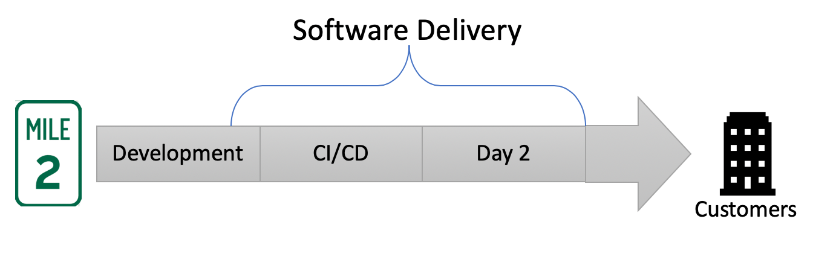
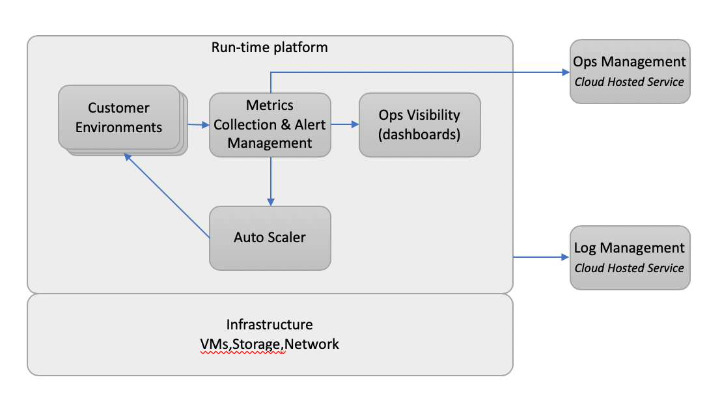

# Introduction

## What's  Included in this Article

* **Deck** - A short presentation to...
    * set context and
    * state a **Software Delivery** vision
* **Demo** - Demonstrate development capabilities;
    * quick-start apps
    * custom quick-start apps
    * cloud based dev sandbox

## What's Left for a Future Article

* **Metrics**
* **Alerting/SLA**
* **Auto Scaling**

---
# How to be a High Preforming Team

>Armed with `robust data-gathering and statistical analysis` techniques, we have been able to discover significant results while working on the State of DevOps Report. We’ve been able to measure and quantify software delivery performance, its impact on organizational performance, and the various capabilities that contribute to these outcomes. 

> The key to successful change is measuring and understanding the right things `with a focus on capabilities`—not on maturity.

## Approach Based on Industry Research


* Quotes above from the book: [Forsgren PhD, Nicole. Accelerate: The Science of Lean Software and DevOps: Building and Scaling High Performing Technology Organizations](https://www.amazon.com/Accelerate-Software-Performing-Technology-Organizations/dp/1942788339)
* Many ideas presented here are based on the principles in this book.
* Also technical details presented here are based on the book: [Viktor Farcic. The DevOps 2.6 Toolkit: Jenkins X leanpub.com](https://leanpub.com/the-devops-2-6-toolkit) and  [02-intro.sh](https://gist.github.com/vfarcic/8cef206b4df0b1bbec3060d1d45c2a80)

---
# Software Delivery



* **Development** - Areas where Dev and Ops need to work together;
    * Branching strategy
    * Quickstarts - 0 to live in 5! (see demo)
    * Testing, Development and Promotion tools
* **CI/CD**
    * Auto-scaling CI/CD runners
    * GitOps/IaC that is Cloud Neutral (same process for AWS, Azure, GCP or on-premise)
    * Environments (PR preview, Staging, Production)
* **Day 2** - Ongoing support and maintenance after going live
    * Monitoring, Alerting, Metrics, Visibility, SLOs/SLAs, etc...
    * Upgrades and patching
    * Operations Management (on call support)

---

# Deployment Platform



* **Run-time platform (Kubernetes)** - a "run anywhere" platform with facilities for deploying and running a variety of workload
    * Service discovery, load balancing
    * Self-healing
    * Storage orchestration
    * Automated rollouts and rollbacks
    * Automatic binpacking
    * Horizontal scaling
    * Batch execution
* **Customer Environment (Helm)** - Customer preview, staging and production environments that host client applications
    * A Helm chart used to describe the applications and all its dependancies
    * Chart configuration provide repeatable application installation and serve as a single point of authority
    * Versioned, in source control and portable
* **Metrics (Prometheus)** - Time-series database for collecting application and system metrics
    * Dimensional data in a time series database
    * PromQL - query language for defining alerts or ad-hoc graphs and reports
    * Alert Manager - Handles alerts performing functions such as
        * deduplication, grouping
        * routing to correct receiver Slack, email, PagerDuty, etc...
* **Ops Visibility (Grafana)** - Visualization tool for building dashboards that help you understand your metrics
* **Auto Scaler (HPA)** - Ability to scale applications
    * based on CPU or RAM utilization or
    * custom thresholds defined using collected metrics
* **Ops Management (PagerDuty)** - Incident and on-call management service
* **Log Management (Papertrail)** - Centralized log aggregation service in Papertrail or cloud provider.
* **Infrastructure (GCP)** - Public cloud or in-premises infrastructure. GCP, AWS, Azure, etc..  


---

# Jenkins X

## 7 Capabilities of Jenkins X

Taken from the Accelerate book here are 7 practices of high performing teams. Jenkins X uses open source software to automate these practices.   

**1. Use version control for all artifacts**

* source code and code (IaC)
* when things go bad we can revert
* provides an audit trail

**2. Use trunk-based development**

* developers collaborate on code in a single branch called 'trunk'. They therefore avoid merge hell, do not break the build, and avoid conflicts.
* the use of long-lived featured branches is associated with low performing teams
* trunk-based development is associated with high performing teams

**3. Use loosely coupled architecture**

* High performing teams use the cloud well to deliver highly available, multi-az deployments that are self healing and auto scaling.
* microservices allows teams to move quicker; many *independent* teams can move quicker than one large team.
* Kubernetes is ideal for running microservices.  
    * runs everywhere while providing a consistent abstraction across all cloud providers
    * a single way to package applications and run them in any cloud (or on premise)!
    * multi cloud is now achievable by mortals
* challenge: teams now need to figure out how to do many things well; microservices, cloud, Kubernetes, CI/CD, etc.. this is where Jenkins X comes in

**4. Implement continuous integration (CI)**

**5. Implement continuous delivery (CD)**

**6. Automate your deployment process**

**7. Architect for empowered teams**

--------------------------------------------------------------------------------

# How does Jenkins X help?

**Automates the setup of your tools + environments**

* Jenkins, helm, skaffold, nexus, monocular
* Developer not require to be an expert in Ops stack (but it helps!)

**Automates the CI/CD for your application on Kubernetes**

* Docker images
* Helm charts
* Jenkins Pipelines

**Uses GitOps to manage promotion between environments**

* automated promotion; Test -> Staging -> Production
    * use PR to promote between environments. The team can code review/approve coding as well as configuration changes
    * an approved PR tells the team what is in prod and when it was installed.  And, if things go bad, just revert the PR to roll back.
    * could use CLI tools to promote code to various environments but no one can see what you are doing, reverting back is not easy and it is dangerous especially when you are trying to move fast
* use git as the source of truth for each environment
    * a source repo will list all the microservices, the version of each and any environment specific configuration running in the prod environment

**Lots of feedback**

* E.g. commenting on issues as they hit Staging + Production

---

# Jenkins X Overview

**Install the jx binary**

```
https://jenkins-x.io/geting-started/install/
```

**Create a new k8s cluster on GKE**

```bash
$ jx create cluster gke
```
As of now, supported clouds:

* create cluster aks Create a new Kubernetes cluster on AKS: Runs on Azure
* create cluster aws Create a new Kubernetes cluster on AWS with kops
* create cluster eks Create a new Kubernetes cluster on AWS using EKS
* create cluster gke Create a new Kubernetes cluster on GKE: Runs on Google Cloud
* create cluster iks Create a new kubernetes cluster on IBM Cloud Kubernetes Services
* create cluster minikube Create a new Kubernetes cluster with Minikube: Runs locally
* create cluster minishift Create a new OpenShift cluster with Minishift: Runs locally
* create cluster oke Create a new Kubernetes cluster on OKE: Runs on Oracle Cloud


**Install Jenkins X on an existing cluster**

```bash
$ jx install --provider=...
```

---

# What does that give me?

**Each team gets their own:**

* Development tools environment
    * Jenkins master
    * Elastic pool of Kubernetes build pods
    * Helm + Monocular
* Staging environment
* Production environment

**Also...**

* This empowers each team to work independently and release when they want
* Can configure more environments but out-of-the-box you get one staging and one production environment.
* A new version is released for each PR merged to 'trunk'
* Each release is automatically promoted to staging but requires a manual step to promote to production by default.  This can be changed for 100% automation.


---

# Importing and Creating Projects

**Import existing**

If you already have some code.

```bash
$ jx import
```

**Create new applications from quickstarts**

This is preferred so you know everything is setup correctly. The import works but you never know.

```bash
$ jx create quickstart
```
* there are a bunch of quick starts they are open source so you can check them out [here](https://github.com/jenkins-x-quickstarts)
* There is one for most of the popular development platforms
* You can create a custom template if you like


# What you get from a quickstart

`jx create` will...

* Create a project repo GitHub
* Create a dockerfile
* Create a helm chart
* Create environment repos in GitHub (staging and production)
* Setup all the webhooks in GitHub
* Setup all your CI/CD (Jenkins pipelines)

For examlle, this will create a Simple Hello World node.js appliation that listens on localhost:8080

```bash
$ jx create quickstart node-http
```

---
# Quickstart Demo


## Prerequisite Tools

It is up to you to figure out how to install the following tools.  The general approach is to go to the source and follow their instruction. In other cases `brew` will work.

* git (and gitbash)
* kubectl
* Helm
* AWS CLI and eksctl (for  EKS)
* gcloud (for GKE)
* Azure CLI (for AKS)
* jq
* hub

**Jenkins X CLI**

For macOS:

```bash
brew tap jenkins-x/jx
brew install jx
```

## Create Cluster with jx

**Disable Nexus**

We will not need Nexus let's just turn it off.

```bash
echo "nexus:
  enabled: false" | tee myvalues.yaml
```

**Create the cluster**


```bash
# If GKE
PROJECT="aeg-jenkinsx"
JX_ENV="jxeMMDD" # change this each as needed

jx create cluster gke \
    -n $JX_ENV \
    -p $PROJECT \
    -z us-east1-b \
    -m n1-standard-1 \
    --min-num-nodes 2 \
    --max-num-nodes 5 \
    --default-admin-password aegadmin \
    --default-environment-prefix $JX_ENV \
    --preemptible=true  # if testing

# The browser will open so you can authenticate with google cloud
# Then you will be prompted for a few things, here are my responses:

? Would you like to access Google Cloud Storage / Google Container Registry? Yes
? Would you like to enable Cloud Build, Container Registry & Container Analysis APIs? No
? Would you like to enable Kaniko for building container images No     
? No existing ingress controller found in the kube-system namespace, shall we install one? Yes
? A local Jenkins X versions repository already exists, recreate with latest? Yes
? Domain 34.73.130.212.nip.io

```

--------------------------------------------------------------------------------

# Create Quickstart Project

Create a sample project to see how things work. Commands for this section have been adapted from the book: [03-quickstart.sh](https://gist.github.com/vfarcic/a6a6ebc16f75e2cd8902f7695cbce5a5)

Create a cluster as we did before, see [Create Cluster](#create-cluster). Then create the project.


## Create project

```bash
QS_PROJECT="jxqsMMDD" # change this as needed

jx create quickstart -l go -p $QS_PROJECT -b
jx get activities
```


--------------------------------------------------------------------------------

# Cleanup

## Destroy Cluster

Remove the cluster and everything else.

```bash
GH_USER="tgilkerson"

hub delete -y $GH_USER/environment-$JX_ENV-staging
hub delete -y $GH_USER/environment-$JX_ENV-production

rm -rf ~/.jx/environments/$GH_USER/environment-$JX_ENV-*
rm -f ~/.jx/jenkinsAuth.yaml

gcloud container clusters delete $JX_ENV --zone us-east1-b


# remove unused disks
gcloud compute disks delete \
    $(gcloud compute disks list \
    --filter="-users:*" \
    --format="value(id)")
```

## Cleanup project

```bash
hub delete -y $GH_USER/$QS_PROJECT

cd ..
rm -rf $QS_PROJECT

```
